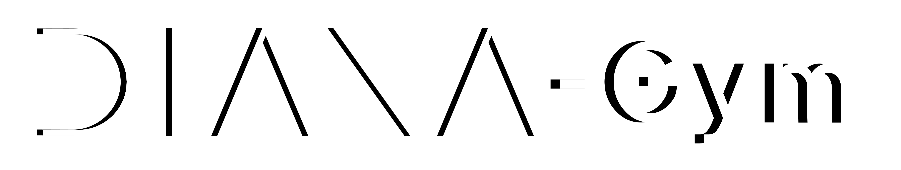

 


 _DIANA-Gym_ is a framework for training Reinforcement Learning agents for autonomous navigation tasks of rovers intended for planetary exploration. It is based upon several open-source projects and libraries, such as [ROS2](https://docs.ros.org/), [ros2learn](https://github.com/AcutronicRobotics/ros2learn) and [Gym-Gazebo2](https://github.com/AcutronicRobotics/gym-gazebo2) from [Acutronic Robotics](https://acutronicrobotics.com/), [PIC4rl_gym](https://github.com/PIC4SeR/PIC4rl_gym) from [Pic4Ser](https://pic4ser.polito.it/), [Stable Baselines3](https://stable-baselines3.readthedocs.io/en/master/#), OpenAI [Gym](https://github.com/openai/gym) and [Gazebo](http://gazebosim.org/).

It enables the training and monitoring of Reinforcement Learning agents in simulated environments, in particular, it features the simulated Marsyard from [European Rover Challenge 23](https://roverchallenge.eu/) as default environment. The framework is designed to be modular and extensible, allowing the user to easily add new environments, algorithms and robots, as well as to easily extend it to different robotic tasks.

_DIANA-Gym_ is being developed and maintained by [DIANA](https://github.com/team-diana), a student team from Politecnico di Torino. 


---

__Please note that this project is still under development and is to be considered in Beta testing. Fixes and additional features are planned.__


---

### Installation and Setup

Please refer to the [ros2learn installation guide](https://github.com/AcutronicRobotics/ros2learn/blob/dashing/Install.md) to install the required dependencies. 
Other useful packages are ``Stable Baselines3`` and ``Wandb``, which can be installed with ``pip3 install stable-baselines3 wandb``.

Once the dependencies are installed, edit the value of the ``MARA_PATH`` variable in ``environments/gym-gazebo2/gym_gazebo2/utils/ut_launch.py`` to the path of your workspace built while following [this guide](https://github.com/AcutronicRobotics/gym-gazebo2/blob/dashing/INSTALL.md#create-a-ros-workspace). Finally, edit accordingly also the bash script at ``environments/gym-gazebo2/provision/mara_setup.sh``.

### Example usage

An example script is available at ``experiments/examples/DIANA/train_test.py``

Run ``python train_test.py -g`` to train an agent using the default configuration with the visual interface.


### Paper

This work has been presented at IAC23, paper available at https://iafastro.directory/iac/paper/id/80146/ext/appendix/IAC-23,D1,2,9,x80146.pdf
```
@misc{
Author = {Federico Mustich, Leonardo Maria Festa, Fabrizio Stesina, Raffaello Camoriano, Gabriele Tiboni},
Title = {Point Cloud-Based Reinforcement Learning for Autonomous Navigation of a Robotic Rover on Planetary
Surfaces},
Year = {2023},
}
```

__Stay DIANA, Stay Mambo.__